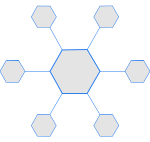

# Octopusflow [![CI][1]][1] [![Go Report Card][2]][2] [![codecov][3]][4] [![GoDoc][5]][6]

[1]: https://github.com/octopusflow/octopusflow/workflows/CI/badge.svg
[2]: https://goreportcard.com/badge/github.com/octopusflow/octopusflow
[3]: https://codecov.io/gh/octopusflow/octopusflow/branch/master/graph/badge.svg "Coverage badge"
[4]: https://codecov.io/gh/octopusflow/octopusflow "Codecov Status"
[5]: https://godoc.org/github.com/octopusflow/octopusflow?status.svg "GoDoc badge"
[6]: https://godoc.org/github.com/octopusflow/octopusflow "GoDoc"

Octopusflow core
